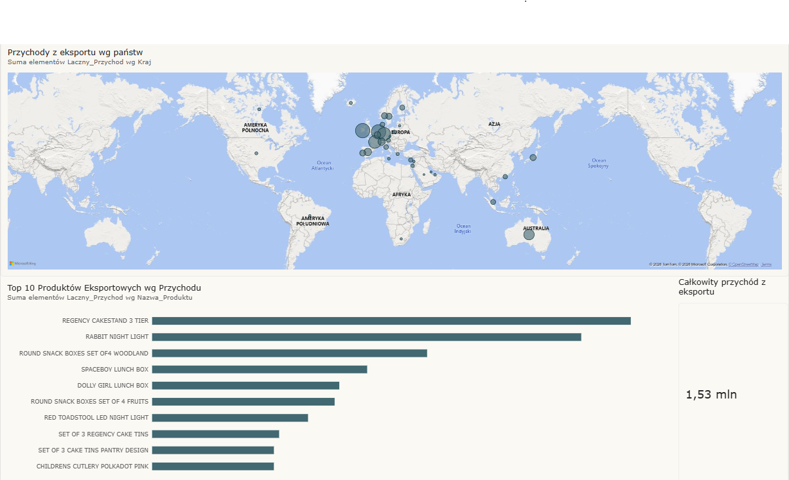

# European E-commerce Sales Dashboard 🌍📊

## 📌 Project Overview
This project analyzes transactional e-commerce data to identify top-performing export products and map out revenue distribution across the European market. The goal was to transform raw sales data into a clear, interactive business dashboard.

*(Upewnij się, że Twój zrzut ekranu nazywa się dashboard_preview.png i leży w tym samym folderze)*

## 🛠️ Tools & Technologies
* **Database & Querying:** SQLite, SQL
* **Data Visualization:** Microsoft Power BI
* **Key Skills:** Data Cleaning, Aggregation, Spatial Visualization

## ⚙️ Data Processing (SQL)
The raw dataset required preparation before visualization. Key SQL operations included:
* Filtering out returns (negative quantities) and canceled invoices.
* Isolating export data by excluding the domestic market.
* Aggregating total revenue (`Quantity * UnitPrice`) grouped by product name and destination country.

## 💡 Key Business Insights
1. **Total Export Volume:** The analyzed export operations generated **1.53M** in revenue.
2. **Top Product:** The *Regency Cakestand 3 Tier* is the undisputed best-seller among export goods.
3. **Market Distribution:** The geographic visualization highlights the strong purchasing power of specific internal European markets (e.g., Germany, Ireland) within the overall export structure.